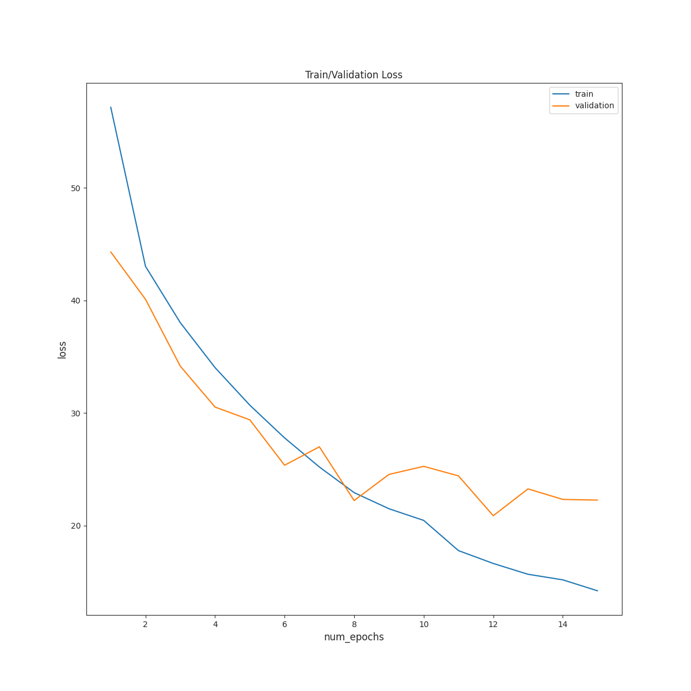
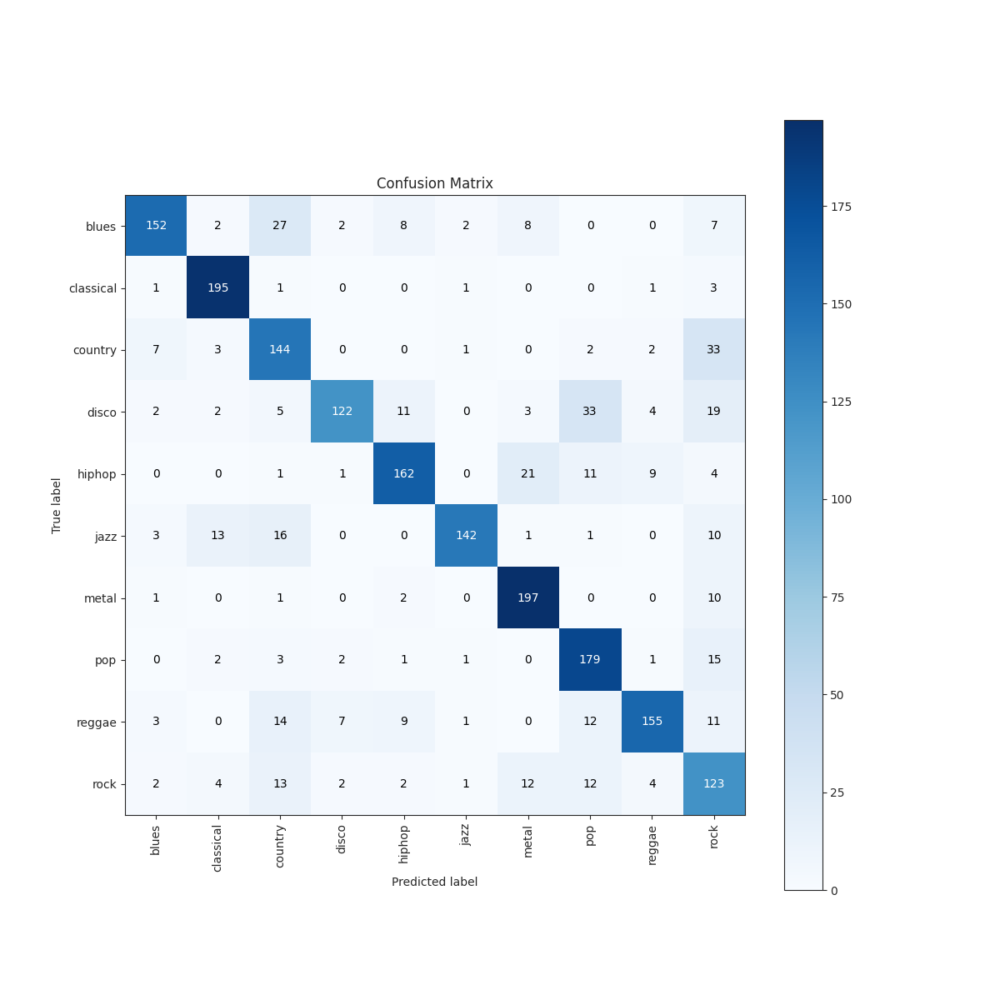

# Music-Genre-Classification
50.039 Theory and Application of Deep Learning: Project

## Usage

Git clone this project. To predict the music genre of your audio file, just use

	$ python predict_audio.py --music_path [music-path] # defaults to use our final model

The outputs will be the classification labels for each predetermined chunk of the music file that is aggregated into its normalised value counts. For example,

```
Predictions for test.mp3:
classical    0.989474
jazz         0.010526
```

This means that the model is 98.9% percent sure that it is of the classical genre.

## Setup

### Packages required

- Python 3.9 and above
- torch
- sklearn
- pandas
- numpy
- librosa
- tqdm
- seaborn
- scikit-plot
- matplotlib
- ffmpeg (for mp3 input - you might need to install it as a standalone app from their [website](https://www.ffmpeg.org/download.html) or your preferred package manager if pip installing still yields audio backend error)

Alternatively, you can install from the requirements file from our virtual environment:

 	$ pip install -r requirements.txt

### Process the data

	$ python [script-name] -h # for help

- [`mfcc_extractor.py`](./mfcc_extractor.py) will extract MFCC features from the dataset.
- [`process.py`](./process.py) will process and split the data from the output of [`mfcc_extractor.py`](./mfcc_extractor.py) into train and test sets if needed.
- [`cnn_2d_parallels.py`](./cnn_2d_parallels.py) will train the model based on the outputs of [`process.py`](./process.py).
- [`predict_audio.py`](./predict_audio.py) will run the model chosen to output a prediction for a music file.

## Model

The config used to create the final model is as follows in `cnn_2d_parallels.yaml`:

```
n_epochs: 15
batch_size: 32
optimiser_cfg:
  lr: 0.001
```

We initially trained the model using a 20% test split. These are the results. The actual model is trained on the full dataset.

From `Models/2022-04-24_21-38-09_CNN_2D_Split_True.pt`:

```
              	precision    recall  f1-score   support

       blues       0.89      0.73      0.80       208
   classical       0.88      0.97      0.92       202
     country       0.64      0.75      0.69       192
       disco       0.90      0.61      0.72       201
      hiphop       0.83      0.78      0.80       209
        jazz       0.95      0.76      0.85       186
       metal       0.81      0.93      0.87       211
         pop       0.72      0.88      0.79       204
      reggae       0.88      0.73      0.80       212
        rock       0.52      0.70      0.60       175

    accuracy                           0.79      2000
   macro avg       0.80      0.78      0.78      2000
weighted avg       0.81      0.79      0.79      2000
```


